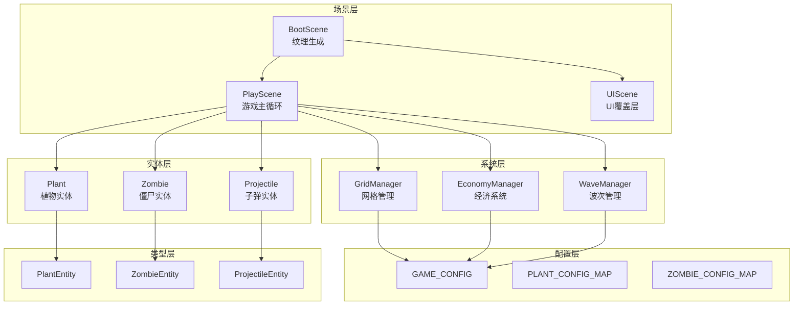

# PlantsGame MVP 复盘报告

**日期**: 2026-05-23
**版本**: MVP 1.0
**在线 Demo**: https://sunrong.site/plantsgame/

---

## 1. 项目概览

PlantsGame 是一款基于 Phaser 3 + TypeScript + Vite 的塔防游戏 MVP，致敬《植物大战僵尸》。游戏在 GitHub Pages 上运行，采用像素复古风格，聚焦核心战斗循环。

---

## 2. 核心功能清单

| 功能 | 状态 | 说明 |
|------|------|------|
| 游戏循环 | ✅ 完成 | 种植 → 阳光收集 → 资源管理 → 射击 |
| 波次僵尸系统 | ✅ 完成 | 3 波次，间隔递增，混合类型 |
| 胜负判定 | ✅ 完成 | 通关3波=胜利，僵尸到家=失败 |
| 植物卡片选择 | ✅ 完成 | 豌豆射手/向日葵/坚果墙 |
| 格子高亮反馈 | ✅ 完成 | 悬停时绿色(空)/红色(占用) |
| 僵尸入侵箭头 | ✅ 完成 | 地图左侧静态箭头 |
| 阳光限时机制 | ✅ 完成 | 8秒后自动消失 |
| 游戏重启清理 | ✅ 完成 | shutdown() 正确释放资源 |
| 部署 CI/CD | ✅ 完成 | GitHub Actions 自动部署 |

---

## 3. 技术架构图



**架构特点**：
- **Scene-Entity Pattern**：场景负责协调，实体负责行为
- **数据驱动**：植物/僵尸配置由 `PLANT_CONFIG_MAP` 驱动，便于平衡调整
- **静态工具类**：Plant/Zombie/Projectile 是无状态工具类，便于测试

---

## 4. 亮点与成就

### 4.1 技术亮点

| 亮点 | 说明 |
|------|------|
| 纹理程序化生成 | 所有精灵图在 BootScene 中用 Canvas API 生成，无需外部资源 |
| 多场景协作 | PlayScene + UIScene 并行运行，UI 与游戏逻辑解耦 |
| 完整资源清理 | shutdown() 处理 sprite destroy，防止内存泄漏 |
| 部署全自动化 | GitHub Actions + npm registry 修复，提交即部署 |

### 4.2 AI 协作亮点

| 时刻 | 描述 |
|------|------|
| brainstorming 高效 | 通过先发散后收敛，明确了 C+D 视觉优化方案 |
| 方案对比决策 | 提供了红/绿柔和色 + 静态箭头，避免了过度设计 |

### 4.3 工程成就

- 54 个 Vitest 测试全部通过
- 部署一次成功，后续零维护
- 代码架构清晰，可用于面试展示

---

## 5. 待改进项与下一步规划

### 5.1 高优先级

| 问题 | 说明 | 建议 |
|------|------|------|
| 时间系统不统一 | Plant 使用 `Date.now()`，PlayScene 使用 Phaser `time` | 重构为统一 `gameTime` 管理器 |
| 内存泄漏风险 | WaveManager 中 zombie 引用需确认释放 | 增加引用计数或弱引用 |
| 移动端适配 | 无 `devicePixelRatio` 处理 | 添加高清屏适配 |

### 5.2 中优先级

| 问题 | 说明 | 建议 |
|------|------|------|
| 生产构建体积 | 1.5MB，未进行分包 | 配置 `manualChunks` 分割 Phaser |
| 事件监听优化 | 未使用 `passive` | 提升移动端滚动性能 |
| 僵尸攻击视觉反馈 | 代码有但未验证 | 补充视觉反馈机制 |

### 5.3 低优先级（v1.1 规划）

- [ ] 计分系统
- [ ] 音效
- [ ] 更多植物类型（寒冰射手、樱桃炸弹）
- [ ] 存档功能

---

## 6. AI 协作经验总结

### 6.1 高效协作模式

**模式：先发散后收敛**

```
用户提出问题 → AI 分析全貌 → 给出完整方案 → 用户选择 → 实施 → 验证
```

**典型案例**：地图视觉优化
1. 用户提出地图太小的问题
2. AI 通过 brainstorming 发散出 5 个方案
3. 分析对比后推荐 C+D 组合
4. 用户确认后一次性实现

**经验沉淀**：这种模式避免了"代码写了一半再重构"的风险。

### 6.2 低效协作模式（需避免）

**模式：逐步修复，缺乏完整性验证**

```
用户报告问题 → AI 修 1 个 → 验证 → AI 再修 1 个 → ...
```

**典型案例**：GitHub Pages 部署问题
- 反复 4 次才部署成功
- 每次只解决 1 个问题（npm registry → .npmrc → CI cache → ...）
- 根本原因：缺乏"一次性诊断所有问题"的能力

**根因分析**：
1. AI 倾向于逐步迭代而非一次性完整诊断
2. 缺少主动验证全链路的步骤
3. 用户反馈周期长，问题累积

**改进方向**：
- 下次遇到 CI/部署问题，要求 AI "先完整诊断，列出所有问题再一起修复"
- 引入 verify skill 作为完整性验证环节

### 6.3 AI 游戏开发 SOP 迭代

基于本次复盘，建议优化 SOP 第 3 步：

**当前 SOP**：
```
1. 需求确认
2. brainstorming 方案设计 ← 高效
3. 实施
4. 测试
5. 部署
```

**优化后 SOP**：
```
1. 需求确认
2. brainstorming 方案设计 ← 高效时刻
3. AI 完整诊断（一次性列出所有问题）← 新增
4. 实施（一次性修复所有问题）← 合并
5. verify 完整性验证 ← 强化
6. 部署
```

### 6.4 面试素材建议

| 经历 | 可展示的能力 |
|------|-------------|
| 纹理程序化生成 | Canvas API、Game Asset Creation |
| Scene-Entity Pattern | 架构设计、设计模式 |
| 部署 CI/CD 故障排除 | 问题诊断、DevOps |
| AI 协作沉淀 | 流程优化、效率提升 |

---

## 附录：关键文件索引

| 文件 | 作用 |
|------|------|
| `src/scenes/PlayScene.ts` | 游戏主循环 |
| `src/systems/GridManager.ts` | 网格管理 + 悬停高亮 |
| `src/scenes/BootScene.ts` | 纹理生成 + 箭头纹理 |
| `src/entities/Plant.ts` | 植物实体工具类 |
| `src/entities/Zombie.ts` | 僵尸实体工具类 |
| `docs/superpowers/specs/2026-05-23-map-visual-enhancement-design.md` | 视觉优化设计文档 |